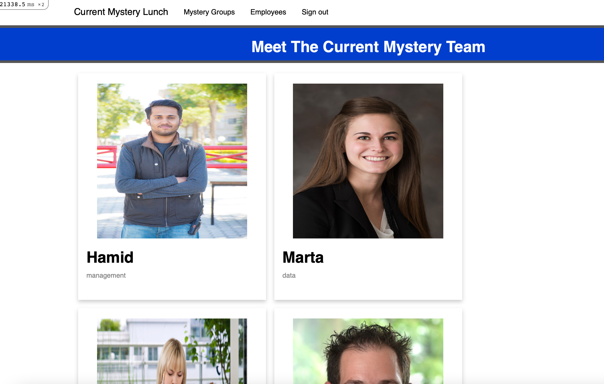
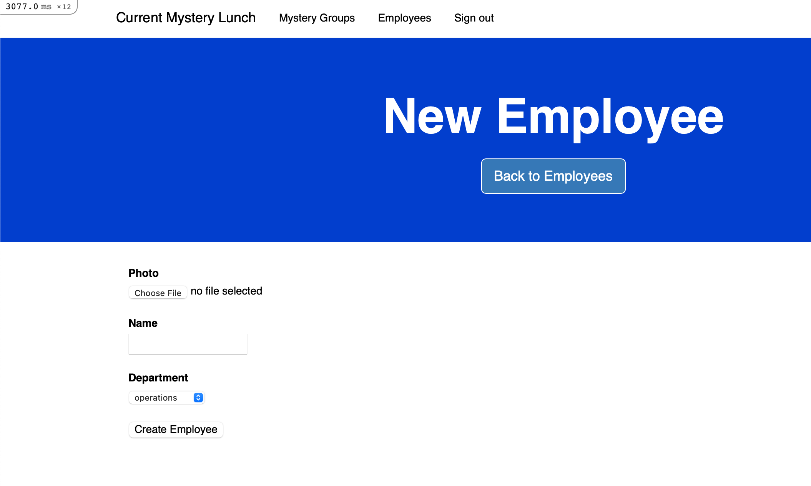

# Assessment
## Mystery Lunch
### Project Requirements are in coding challenge-ruby on rails File


The aim is to express my level of skills and knowledge as they are required to deal with everyday tasks.
To achieve this purpose, I completed all tasks while keeping in mind the task definition.

Solution:
* I used Ruby on Rails Framework for Development.
* Ruby (Version: 2.7.1)
    * CMD (bundle install)
* Rails (Version: 6.1.5)
* Database - Postgres
* View are exposed on localhost:3000
* Database creation
* Database initialization
    * CMD (rake db:setup)
    * I added initial records in db:seed

* For Test Cases I used (Rspec and Shoulda)
* How to run the test suite
    * CMD (bundle exec rspec spec)

* Running instructions:
    * CMD (rails s)
    * Views on Localhost:3000


# Run the Rails Application using Docker
##### First run these commands:

```
docker compose build
docker-compose run web rake db:create
docker-compose run --rm web bundle exec rake db:migrate
docker-compose run --rm web bundle exec rake db:seed
docker compose up
```
*PS: If you're using MAC then it cause an issue in "apt-get update" cmd in Docker, the solution to this problem is going to "Screen Time" setting and change the settings to "Unrestricted web access".

##### First need to Uncomment 3 lines in database.yml
##### Which includes host, username, and password.
# Then Run the Rails Application using without Docker

Bundle install
rake db:setup
host: localhost -> host: database

## Overview

Here Rails applications has three main models according to the following database scheme.
* Mystery has_many Employees. (It can easily achieve with third table named mystery_employees class which contains both employee and mystery id.)
* Admin (Used for authentication purpose. As this task has low pirority so i just used simple devise gem for authentication and have used build in devised:bootstraped views.)


There is a Employee and Mystery CRUD having All the implementations including authentication and complete needed operations.
## Technical Details
### Views

*PS: I just try simple views which shows the technical requirement and needed a lot of improvements in CSS.

1. Listed all Current Month Mystery Lunches.
   ```
   URL: http://localhost:3000/
   (Main Functionality which shows all employees with their partners for current month)
    ```
   
2. Admin Authentication Here only for Employees CRUD 
   ```
   URL: http://localhost:3000/admins/sign_in
   (Need for Restricted Area which is only Employee CRUD)
   (We can add mystery as well and for this just only add "before_action :authenticate_admin!" in mystery controller/
    ```
      
3. List all Employees
   ```
   URL: localhost:3000/employees
   (It list all employees if admin is logged in because it is Restricted area)
    ```
   
4. List all Employees with filters
   ```
   URL: http://localhost:3000/employees?employee_id=&employee_name=Hamid&employee_department=management&commit=Apply
   (Here I add filters for search by ID, Name and Department)
    ```
   
5. Creation of New Employees
   ```
   URL: localhost:3000/employees
   (It needs three Parameters which include name, photo and department)
    ```
   
6. Specific Employee
   ```
   URL: localhost:3000/12
    ```
   
7. List of all Mystery lunches
   ```
   URL: localhost:3000/mystery_groups
   (And here we can search by further filters as well 
    like by id, name, department, mystery month, year 
      and status (which shows is valid or not). )
    ```
   

8. I created crone job which should be run in the first day of the month which is created in 
   
    Directory: lib->tasks->mystery.rake


   

For Further Understanding, please run the code and apply the filters.

### Test Case Implementation

I used Mostly Rspec and little bit Capybara for Test Cases.

* Please check spec Folder which contains all test cases.
  * Run test cases: bundle exec rspec spec
* Initially start with simple Routing Test Cases which explains the whole routes file.
* Next, we have Models Testing.
    * Employee Model:
        1. validations: Normal Validation presence check
        2. validation_with_proper_attribute_values: Here i give dummy data then run test case for model class.
    * Mystery Model:
        1. validations: Normal Validation presence check for code
        2. validation_with_proper_attribute_values: Here I give dummy data to response then run test case for code presence.
* Then Requests Test Cases:
* And finally Views test cases:
    * Mystery all views (CRUD)
    * Employee all view (CRUD)

### In Total 59 Test Cases are implemented on localhost testing.


## That's ALL, Folks!

###

##### *** In case something isn't clear or any issue while setup, feel free to contact me. Email Address: hamidiqbal598@gmail.com

## GOOD BYE

